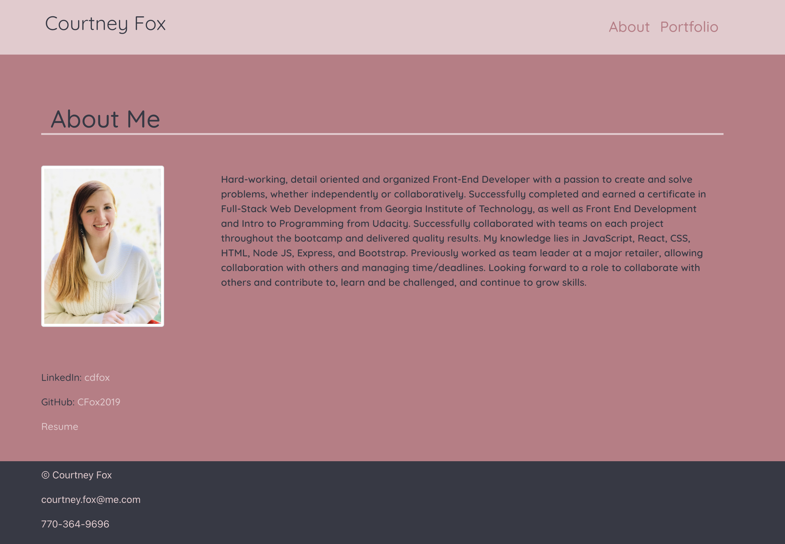
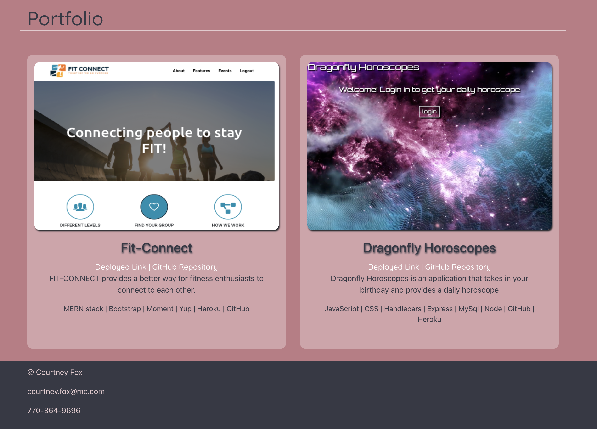

# Portfolio-Reach-Edition

## Table of Contents

* [Description](#description)
* [Screenshots](#screenshots)
* [Links](#links)
* [Questions](#questions)
* [License](#license)

## Description
In my portfolio, you can find the 'About Me' page is the first page you will see. This includes my portrait and a description about myself. This page also includes links to my LinkedIn, GitHub, and my Resume. To view a portfolio of my work/projects, click 'Portfolio' in the nav bar. From there, you can view an image of my projects, along with their deployed links and their direct GitHub repositories.

### Screenshots

## Links

* GitHub: [CFox2019](https://github.com/CFox2019)
* GitHub:  [Portfolio-React-Edition](https://github.com/CFox2019/Portfolio-React-Edition)
* gh-pages: [Portfolio-React-Edition](https://cfox2019.github.io/Portfolio-React-Edition/)
* LinkedIn: [cdfox](https://www.linkedin.com/in/cdfox/)
* [Resume](activities/20-State/02-Homework/Portfolio-React-Edition/src/assets/courtney-fox-resume.pdf)

## Installation

run 'npm i' in the command line

## Usage

run 'npm start' in the command line
## Questions

Email me at [courtney.fox@me.com](courtney.fox@me.com) with additional questions.

## License
This project is covered under the MIT license.
